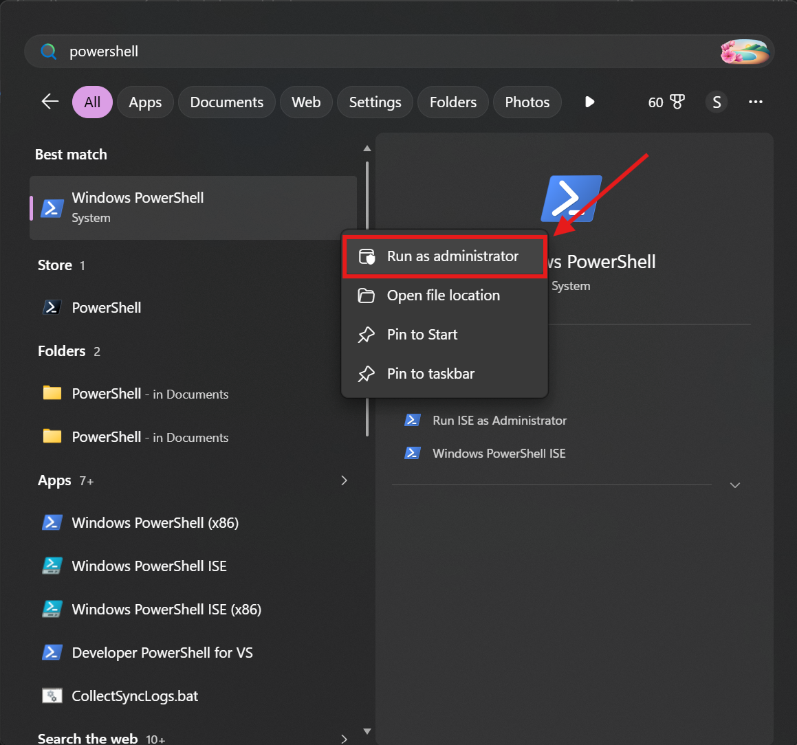
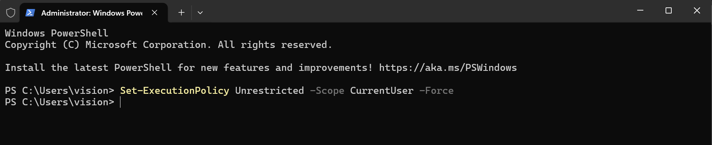
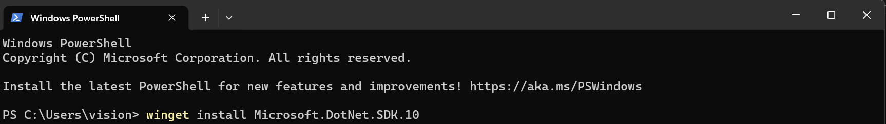
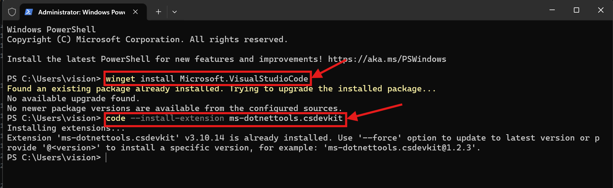

# .NET 10 Installation Guide - Windows

> Follow each step in order. All commands run in a single PowerShell window.

---

## Step 1 : Open PowerShell as Administrator

Press **Win + S**, type `PowerShell`, right-click the result and choose **Run as Administrator**.



>  **Administrator required** — this lets winget install software system-wide and allows changing the execution policy.

---

## Step 2 : Set PowerShell Execution Policy

Windows blocks scripts by default. Paste this command and press **Enter**:

```powershell
Set-ExecutionPolicy Unrestricted -Scope CurrentUser -Force
```



>  `-Scope CurrentUser` limits this change to your account only — other users on the machine are unaffected.

---

## Step 3 : Confirm if Prompted

If you see a confirmation prompt, type **Y** and press **Enter**.


---

## Step 4 : Install the .NET 10 SDK

**winget** is Windows' built-in package manager. The SDK includes the runtime, ASP.NET Core, and the `dotnet` CLI — no separate downloads needed.

```powershell
winget install Microsoft.DotNet.SDK.10
```



>  **This installs everything** — the .NET SDK bundles the base runtime and ASP.NET Core runtime. You do not need to install the runtime separately.

---

## Step 5 : Install VS Code & C# Extensions

Run these commands **one by one**. After VS Code installs, open a **new** terminal window so the `code` command becomes available, then run the extension command.

```powershell
winget install Microsoft.VisualStudioCode
```

```powershell
code --install-extension ms-dotnettools.csdevkit
```



> **C# Dev Kit installs two extensions** ; it automatically pulls in the base C# (Roslyn) extension as a dependency, giving you IntelliSense, error checking, and a Solution Explorer out of the box.

---

## Step 6 : Verify your installation ✓

Open a **new** PowerShell window (no Administrator needed) and run:

```powershell
dotnet --version
dotnet --list-runtimes
```

You should see output like this:

```
10.0.x
Microsoft.AspNetCore.App 10.0.x [C:\Program Files\dotnet\shared\...]
Microsoft.NETCore.App 10.0.x [C:\Program Files\dotnet\shared\...]
```

Both `AspNetCore.App` and `NETCore.App` appearing confirms the SDK and runtimes installed correctly.

---
