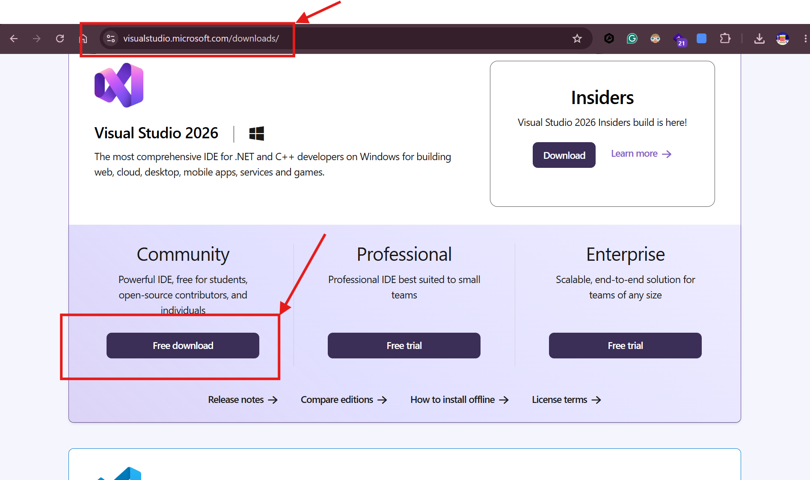
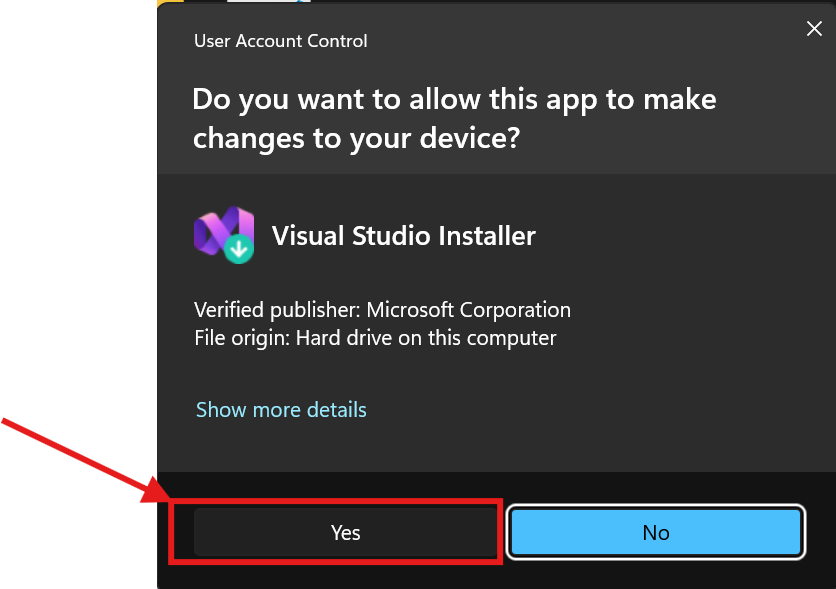
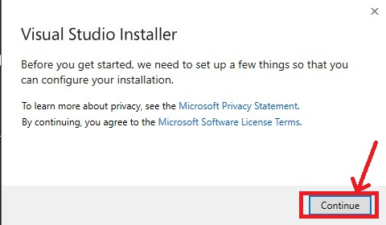
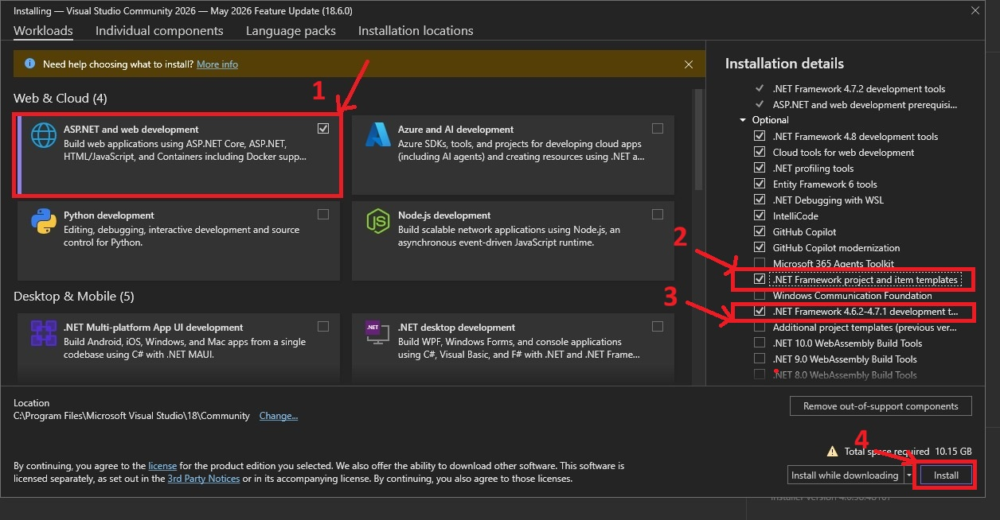
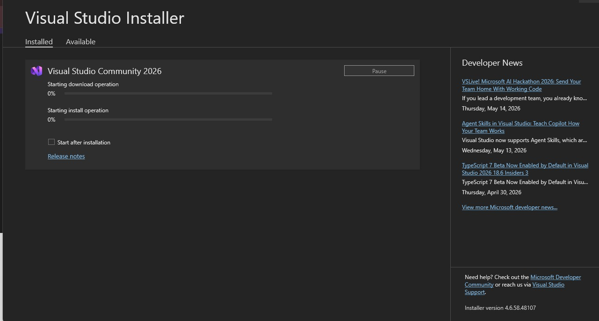
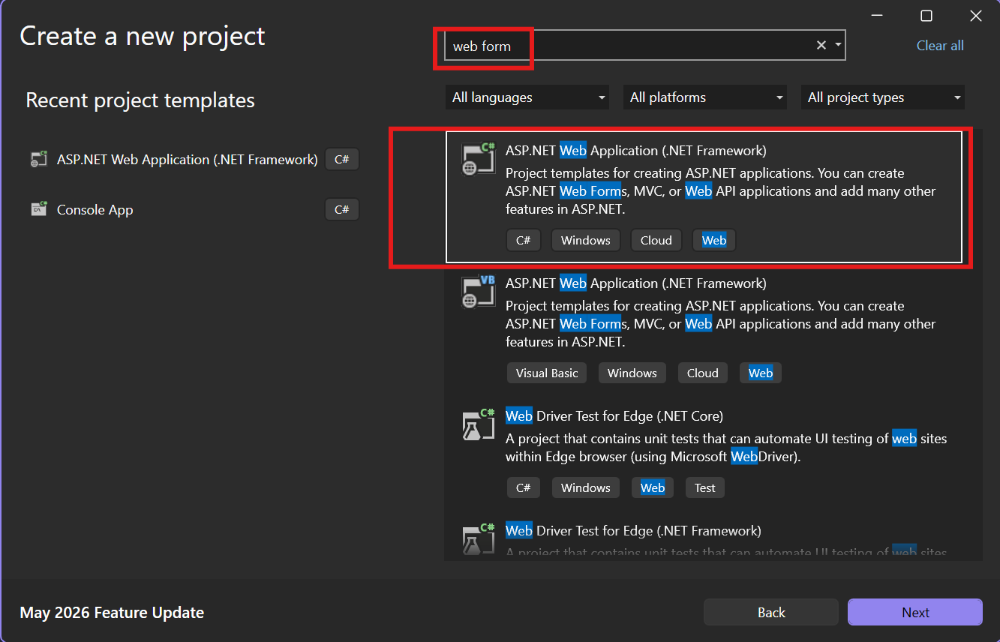

# Visual Studio Installation Guide
### ASP.NET Web Forms Development Setup : .NET Framework 4.6.2 – 4.7.1

---

## Overview

This guide walks you through installing **Visual Studio 2026 Community** and configuring it for **ASP.NET Web Forms development** using the classic **.NET Framework** (versions 4.6.2 through 4.7.1).

---

## Prerequisites

| Requirement | Minimum | Recommended |
|---|---|---|
| OS | Windows 10 (64-bit) | Windows 11 |
| RAM | 4 GB | 8 GB or more |
| Disk | 20 GB free | 50 GB SSD |
| Internet | Required for download | Stable broadband |
| Account | Microsoft account (optional) | Recommended for license management |

---

## Step 1 — Download the Visual Studio Installer

Open your browser and navigate to the official Visual Studio download page:

```
https://visualstudio.microsoft.com/downloads/
```

Under **Visual Studio 2026**, click the **Free download** button beneath the **Community** edition. The installer executable (`VisualStudioSetup.exe`) will be saved to your Downloads folder.

> **Note:** The Community edition is completely free for individual developers, students, and open-source contributors. It includes every feature required for this course.



---

## Step 2 — Run the Installer and Accept Permissions

Locate **VisualStudioSetup.exe** in your Downloads folder and double-click it. When Windows displays a **User Account Control (UAC)** dialog asking for permission to make changes to your device, click **Yes** to continue.

> ⚠️ **Important:** If your organisation's IT policy prevents UAC elevation, contact your system administrator — administrator rights are required for installation.



The installer will download a small bootstrap component and then display the **Visual Studio Installer** welcome screen. This may take a minute depending on your internet speed.



---

## Step 3 — Select the ASP.NET and Web Development Workload

The installer groups components into **Workloads**. Scroll down (or look in the **Web & Cloud** section) and check the box labelled **ASP.NET and web development**.



Selecting this workload automatically includes the core web tools, Razor, and the IIS Express local web server needed for Web Forms projects.

Next, on the Installation details tab on the right hand side, check the box labelled  

**.NET Framework project and item templates** and  

**.NET Framework 4.6.2-4.7.1 development tools** 

---

## Step 4 — Review and Install

Click the **Install** button in the bottom-right corner of the installer. A summary pane on the right lists everything that will be downloaded and installed — verify it includes the **ASP.NET and web development** workload before proceeding.


The installer will now download and install all selected components. Typical download size is **4–8 GB**; installation takes **15–45 minutes** depending on your hardware and internet connection. You can continue using your PC during this time.

> ⚠️ **Important:** Do **not** close the installer or shut down your PC while installation is in progress. If interrupted, re-run `VisualStudioSetup.exe` — it will resume from where it stopped.



---

## Step 5 — Launch and Verify

When installation completes, click **Launch**. Visual Studio will start and prompt you to sign in with a Microsoft account (optional — you can skip this for a 30-day evaluation, or sign in to unlock the Community edition permanently).


### Verify the Web Forms Template Appears

Click **Create a new project**. In the search bar type `Web Forms` or browse under **C# → Windows → Web**. You should see:

| Template Name | Type | Framework |
|---|---|---|
| ASP.NET Web Application (.NET Framework) | Web Forms | 4.6.2 / 4.7 / 4.7.1 |
| Empty ASP.NET Web Application | Web | 4.6.2 / 4.7 / 4.7.1 |



---

## Troubleshooting

| Problem | Solution |
|---|---|
| Web Forms template not visible in New Project dialog | Re-open the VS Installer, click **Modify**, go to **Individual components**, and confirm the **.NET Framework project and item templates** boxes are ticked. Then click **Modify** to apply. |
| Targeting pack version greyed out in project properties | The targeting pack for that version was not installed. Return to the VS Installer, select the missing targeting pack (e.g. 4.7.1), and click Modify. |
| Installer stuck or download fails | Check your internet connection, temporarily disable antivirus, and re-run `VisualStudioSetup.exe`. The installer will resume the download. |
| 'Cannot open project' error after install | Run Visual Studio as Administrator once (right-click → Run as administrator). This resolves most first-run permission issues. |

